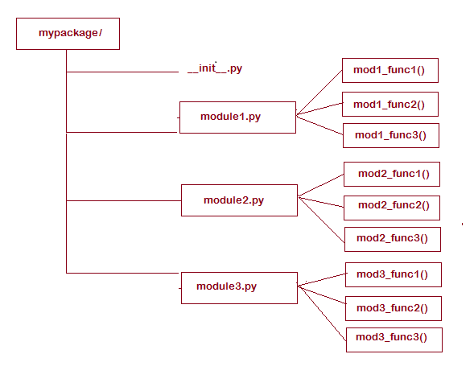

# Sumit-Intern

# Date 9-June-2022


## FIRST HALF

- ✅ Text Wrap function
```
Only i have read Text Wrap Because while practicing text wrap, i found i am running on 3.8 interpreter and some how it dose not support text wrap  
Did lots of troubleshooting but no change so HARDstoped this function to Read only

```


- ✅ [Hacker Rank_Python](https://github.com/sp18-interns/Sumit-Intern/tree/main/09-June-2022/Hacker_Rank)
- ✅ [Hacker Rank_SQL](https://github.com/sp18-interns/Sumit-Intern/tree/main/09-June-2022/Hacker_Rank_SQL)
## VIDEOS
- 🚫

## ASSIGNMENT
- 🚫

## DOUBTS
- 🚫

## LINKS 
- ✅ [TEXT Wrap](https://docs.python.org/3/library/textwrap.html)


## SECOND HALF 
- ✅ Class Import Option from Module
- ✅ Module Import
    - ✅ [ Import Dir()](https://github.com/sp18-interns/Sumit-Intern/tree/main/09-June-2022/test_sumit)
```
The dir( ) function
The dir() is a built-in-function in python. The dir() returns all the properties and methods, including the given object’s built-in properties.

So when dir() is used on the module, it will give you the variables, functions that are present inside the module.

Here is a working example of dir() on a module. We have a class called Car.py, let us import Car and assign to dir() to see the output.
```
- Packages
  - 
  - [Package Code](https://github.com/sp18-interns/Sumit-Intern/tree/main/09-June-2022/Module)

## VIDEOS
- 🚫

## ASSIGNMENT
- Restaurant Problem by vishal sir

## DOUBTS
- 🚫

## LINKS
- ✅ [Module Link-1](https://www.w3schools.com/python/python_modules.asp)
- ✅ [Module Link-2](https://www.programiz.com/python-programming/modules)
